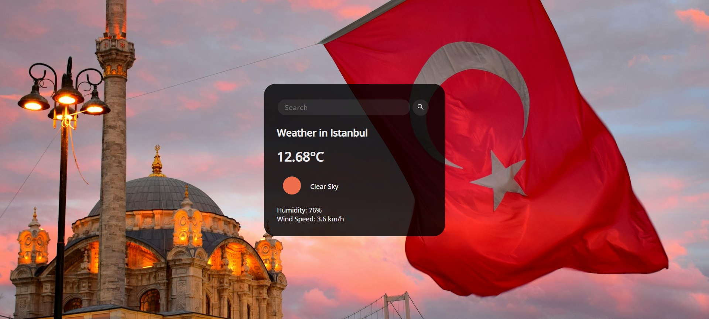

# Weather Forecast

## Weather Forecast with Vanilla.js

This project is a real-time weather forecast application using HTML, CSS, JavaScript.

### APIs

🌦️ [OpenWeatherMap.com](https://openweathermap.org/) API was used for weather

🌆 [Unsplash.com](https://unsplash.com/documentation) API was used for background image

#### API KEY Issue

❗ You must add your API KEY `apiKey:"API KEY GOES HERE"` in script.js
